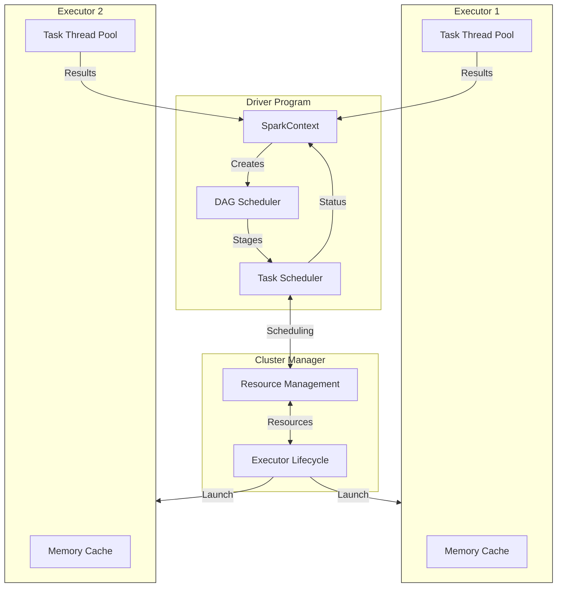
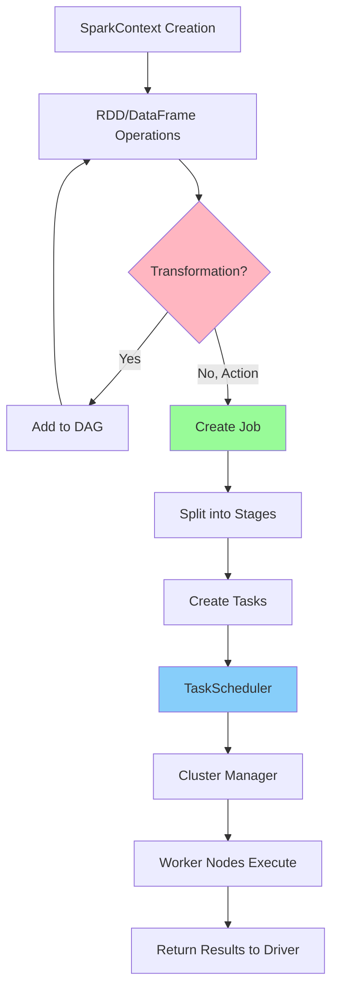

## Spark
- Fault recovery and memory management On a cluster, jobs are scheduled, distributed, and monitored. Interacting with storage systems is one of the most time-consuming aspects of the job.

- To execute streaming analytics, Spark Streaming makes use of Spark Core’s quick scheduling functionality. It ingests data in mini-batches and transforms it using RDD (Resilient Distributed Datasets) transformations. DStream is the most basic stream unit, which comprises a sequence of RDDs (Resilient Distributed Datasets) that process real-time data.

-  Once you do a Spark submit, a driver program is launched and this requests for resources to the cluster manager and at the same time the main program of the user function of the user processing program is initiated by the driver program.

Based on that, the execution logic is processed and parallelly Spark context is also created. Using the Spark context, the different transformations and actions are processed. So, till the time the action is not encountered, all the transformations will go into the Spark context in the form of DAG that will create RDD lineage.

Once the action is called job is created. Job is the collection of different task stages. Once these tasks are created, they are launched by the cluster manager on the worker nodes and this is done with the help of a class called task scheduler.

Clear your understanding about the Classification in Machine Learning

The conversion of RDD lineage into tasks is done by the DAG scheduler. Here DAG is created based on the different transformations in the program and once the action is called these are split into different stages of tasks and submitted to the task scheduler as tasks become ready.

Then these are launched on the different executors in the worker node through the cluster manager. The entire resource allocation and the tracking of the jobs and tasks are performed by the cluster manager.

As soon as you do a Spark submit, your user program and other configuration mentioned are copied onto all the available nodes in the cluster. So that the program becomes the local read on all the worker nodes. Hence, the parallel executors running on the different worker nodes do not have to do any kind of network routing.


Here's the key analysis of Spark's core components and their roles:

Spark Driver:
1. Entry point - runs main method
2. Creates SparkContext/SparkSession
3. Core functions:
   - Converts user code to tasks
   - Schedules tasks on executors via cluster manager

Cluster Manager:
1. Platform-agnostic (supports multiple managers)
2. Responsibilities:
   - Launches executors
   - Allocates resources
   - Dynamic workload adjustment
   - Executor scaling

Executors:
1. Main roles:
   - Execute tasks
   - Provide in-memory storage (RDD/DataFrame caching)
2. Characteristics:
   - Launch at application start
   - Run for entire application lifetime
   - Return results to driver

This architecture enables distributed processing while maintaining centralized control through the driver program.




- Workflow Steps:
1. SparkContext initialization
2. RDD/DataFrame operations defined
3. Transformations build DAG lineage
4. Action triggers job creation
5. Job splits into stages based on shuffle boundaries
6. Tasks created from stages
7. TaskScheduler assigns tasks
8. Cluster manager coordinates execution 
9. Workers process tasks
10. Results returned to driver



###

Spark programs at a
large scale. A Spark driver can launch multiple jobs within one application, each con‐
sisting of multiple tasks. However, it cannot launch more than one application, as
Spark resource management takes place on a per-application basis, not a per-job
basis. Tasks run on one or more executors and typically process different chunks of
the data (see Figure 2-2). Notice that executors are not assigned dedicated storage,
although in Figure 2-2 you can see that storage is attached to the executors. In some
deployments, like on-prem Hadoop clusters, storage can be local to executors, but
often in cloud solutions, this is not the case; in cloud deployments (AWS, Azure, etc.)
there is a separation between storage and compute. In general, Spark prefers to
schedule tasks that access local data, but assigning tasks and executors to local data is
not a requirement.

### pyspark - spark core


I mentioned earlier that Python is a different kind of language—it is not part of the
JVM family. Python is an interpreted language, which means that(unlike with the
JVM) Python code doesn’t go through compilation. You also know that at Spark’s
core, it runs JVM-based processes and is based on Scala and Java. So how does Spark
work with Python? Let’s take a look.
At the most basic level, Spark application components communicate through APIs,
over a shared network. This means that if I have a task running a JVM process, it can
leverage interprocess communication (IPC) to work with Python.
Suppose you’ve written a PySpark app. How does it work with Spark? Essentially,
every time you launch a PySpark job, it creates two processes under the hood: Python
and the JVM. Python is the main program where the code is defined, and the JVM is
the program responsible for Spark query optimization, computation, distribution of
tasks to clusters, etc. Within a PySpark application, the SparkContext itself has a
parameter called _gateway, which is responsible for holding the context to pass the
Py4J application to a JVM Spark server.
Wait, what’s a Py4J application? Py4J is a library written in Python and Java that ena‐
bles Python programs running in a Python interpreter to dynamically access Java
objects and collections in a JVM via standard Python methods, as if they resided in
the Python interpreter. In other words, it enables the Python code to communicate
with the JVM, transparently to the user. Figure 2-3 shows how this works. When the
PySpark driver starts, it initiates a Spark JVM application with a Py4J server config‐
ured to communicate directly with the Spark JVM. Information is transferred
between the PySpark driver and Py4J in a serialized or “pickled” form.

### RDD , Dataframe

RDD abstract? This is a fantastic question, a full consideration
of which would take us deep into the concepts of distributed storage and data source
connectors. RDDs are essentially read-only distributed collections of JVM objects.
However, Spark hides many complications here: RDDs combine application depen‐
dencies, partitions, and iterator[T] => compute functions. A partition is a logical
division of the data itself—you can think of it as a chunk of distributed data. The pur‐
pose of the RDD is to connect each partition to a logical iterator, given the application
dependencies that the executors can iterate on. Partitions are critical because they
provide Spark with the ability to split the work easily across executors.
Spark’s other core data abstractions are DataFrames and Datasets. A DataFrame is
similar to an RDD, but it organizes the data into named columns, like a table in a
relational database. Datasets are an extension of the DataFrame API, providing type
safety. DataFrames and Datasets both benefit from query optimization provided by
the Spark Catalyst engine. This optimization is important, as it makes running Spark
faster and cheaper. As a result, whenever possible, it is advisable to leverage the top-
layer APIs and avoid using RDDs.
A lot of innovation went into the Catalyst, and it is truly fascinating to dive into this
world. However, given that it has little to no impact on machine learning workloads, I
will not delve further into it here.


Let me explain RDD abstraction in simpler, conceptual terms:

### Core Concept of RDD
An RDD (Resilient Distributed Dataset) is like a blueprint for handling big data. Think of it as a giant recipe book that's:
- Split into multiple sections (partitions)
- Can't be changed once created (immutable)
- Can rebuild itself if parts are lost (resilient)

### Three Key Components:

1. **Partitions**
- Think of partitions like splitting a huge book into chapters
- Each chapter can be read independently
- Different readers (executors) can read different chapters at the same time
- Makes parallel processing possible

2. **Dependencies**
- Like a family tree for your data
- Shows how data transforms from one form to another
- If any "child" data is lost, we can recreate it by following this tree
- Two types:
  * Narrow: Direct parent-to-child relationship (like filtering)
  * Wide: Multiple parents to child (like grouping)

3. **Compute Functions**
- The actual instructions for processing data
- Works on one partition at a time
- Like having a specific recipe for each chapter of the book
- Tells executors exactly how to process their chunk of data

### Why This Design is Important

1. **Fault Tolerance**
- If a machine fails, Spark can rebuild just that part
- Like having backup copies of recipes in case pages get damaged

2. **Parallelism**
- Different machines can work on different parts simultaneously
- Like having multiple chefs working on different dishes

3. **Efficiency**
- Data doesn't move unless necessary
- Work is distributed evenly across available resources

Think of it like a well-organized kitchen where:
- The cookbook is split among multiple chefs (partitions)
- Each chef knows exactly what to do (compute functions)
- If a chef makes a mistake, they can check the original recipe (dependencies)


It is important to note that DataFrames, Datasets, and RDDs are considered immuta‐
ble storage. Immutability means that an object’s state cannot be changed after its cre‐
ation. When writing PySpark code, we must keep that in mind. Every time we execute
an operation on a DataFrame, since it cannot change the original one (immutable), to
store the results it creates a new DataFrame. Consider the following code sample,
where we read a DataFrame and run a select operation on it:


Good observation! This is where Spark's clever design comes in. Let me explain:

### The Memory Usage Concern
You're right - in a simple system, creating new copies for each operation would use a lot of memory. However, Spark handles this differently:

1. **Lazy Evaluation**
- Spark doesn't actually create new data immediately
- It just creates a plan (recipe) of what to do
- Only executes when absolutely necessary
- This prevents unnecessary memory usage

2. **Memory Management**
Instead of keeping full copies, Spark:
- Only stores the original data and the transformation plan
- Processes data in chunks (partitions)
- Can clear memory after each step
- Uses disk storage when needed

Example:
```
Original Data: 1,2,3,4,5
Operation 1: Filter even numbers
Operation 2: Multiply by 2
```

Traditional Way (Bad):
```
Step 1: [1,2,3,4,5]           // Original
Step 2: [2,4]                 // New copy after filter
Step 3: [4,8]                 // New copy after multiply
```

Spark's Way (Good):
- Just remembers the plan
- Processes one piece at a time
- Can throw away intermediate results
- Only keeps what's needed

So while it looks like it's creating copies, Spark is actually being very efficient with memory!


## Blogs

- [Top 30 PySpark Interview Questions and Answers](https://www.analyticsvidhya.com/blog/2024/07/pyspark-interview-questions-and-answers/)