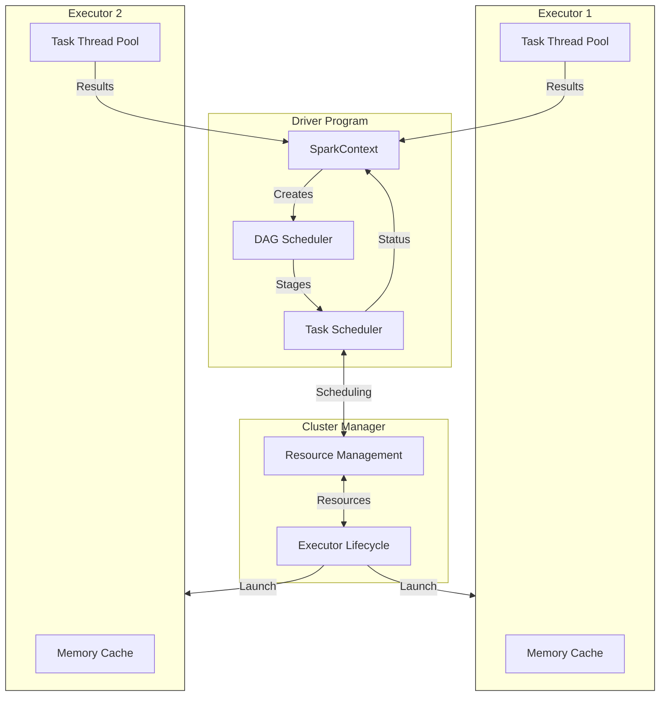
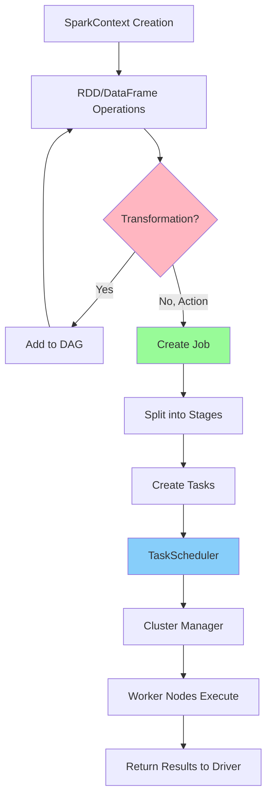

## Spark
- Fault recovery and memory management On a cluster, jobs are scheduled, distributed, and monitored. Interacting with storage systems is one of the most time-consuming aspects of the job.

- To execute streaming analytics, Spark Streaming makes use of Spark Core’s quick scheduling functionality. It ingests data in mini-batches and transforms it using RDD (Resilient Distributed Datasets) transformations. DStream is the most basic stream unit, which comprises a sequence of RDDs (Resilient Distributed Datasets) that process real-time data.

-  Once you do a Spark submit, a driver program is launched and this requests for resources to the cluster manager and at the same time the main program of the user function of the user processing program is initiated by the driver program.

Based on that, the execution logic is processed and parallelly Spark context is also created. Using the Spark context, the different transformations and actions are processed. So, till the time the action is not encountered, all the transformations will go into the Spark context in the form of DAG that will create RDD lineage.

Once the action is called job is created. Job is the collection of different task stages. Once these tasks are created, they are launched by the cluster manager on the worker nodes and this is done with the help of a class called task scheduler.

Clear your understanding about the Classification in Machine Learning

The conversion of RDD lineage into tasks is done by the DAG scheduler. Here DAG is created based on the different transformations in the program and once the action is called these are split into different stages of tasks and submitted to the task scheduler as tasks become ready.

Then these are launched on the different executors in the worker node through the cluster manager. The entire resource allocation and the tracking of the jobs and tasks are performed by the cluster manager.

As soon as you do a Spark submit, your user program and other configuration mentioned are copied onto all the available nodes in the cluster. So that the program becomes the local read on all the worker nodes. Hence, the parallel executors running on the different worker nodes do not have to do any kind of network routing.

Here's the key analysis of Spark's core components and their roles:

Spark Driver:
1. Entry point - runs main method
2. Creates SparkContext/SparkSession
3. Core functions:
   - Converts user code to tasks
   - Schedules tasks on executors via cluster manager

Cluster Manager:
1. Platform-agnostic (supports multiple managers)
2. Responsibilities:
   - Launches executors
   - Allocates resources
   - Dynamic workload adjustment
   - Executor scaling

Executors:
1. Main roles:
   - Execute tasks
   - Provide in-memory storage (RDD/DataFrame caching)
2. Characteristics:
   - Launch at application start
   - Run for entire application lifetime
   - Return results to driver

This architecture enables distributed processing while maintaining centralized control through the driver program.

- Workflow Steps:
1. SparkContext initialization
2. RDD/DataFrame operations defined
3. Transformations build DAG lineage
4. Action triggers job creation
5. Job splits into stages based on shuffle boundaries
6. Tasks created from stages
7. TaskScheduler assigns tasks
8. Cluster manager coordinates execution 
9. Workers process tasks
10. Results returned to driver

## Blogs

- [Top 30 PySpark Interview Questions and Answers](https://www.analyticsvidhya.com/blog/2024/07/pyspark-interview-questions-and-answers/)