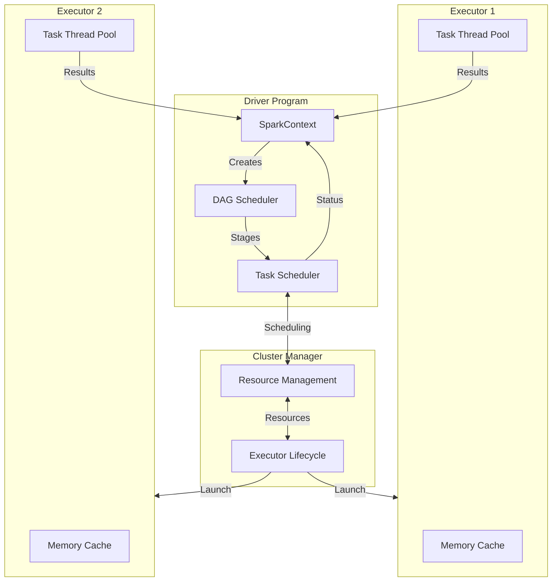
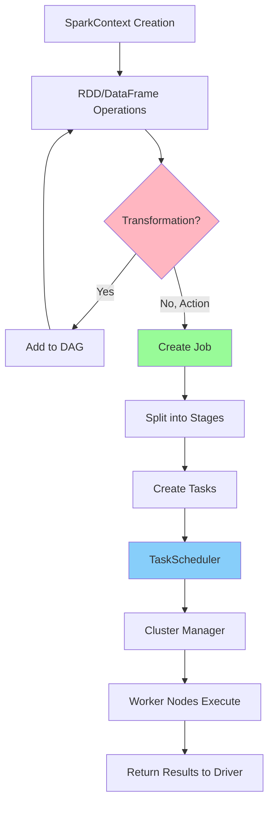
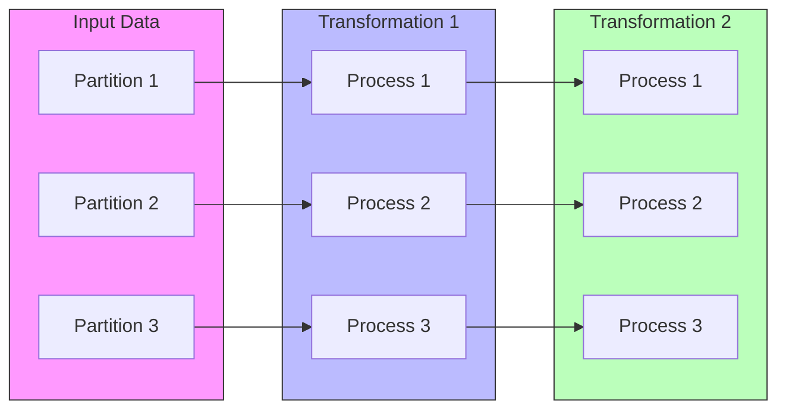
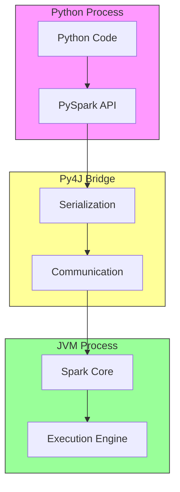
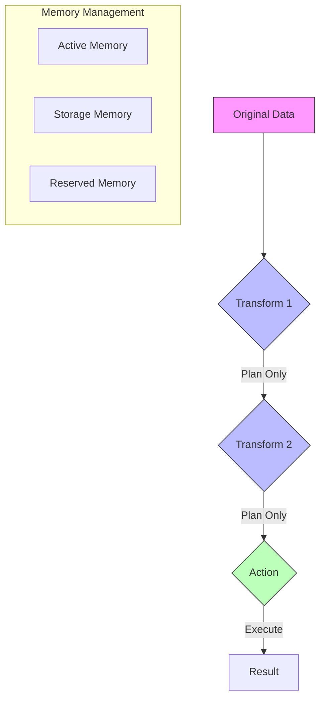

# Understanding Apache Spark: A Comprehensive Guide

## Introduction to Spark Architecture

Apache Spark is a powerful distributed computing system designed for big data processing. To understand how Spark works, let's start with its fundamental architecture and then build up to more complex concepts.

### Core Components

Let's begin with a visual representation of how Spark's core components interact:

The Spark architecture consists of three main components that work together seamlessly:

1. **The Driver Program**
   The driver program serves as the command center of a Spark application. When you submit a Spark application, the driver program springs into action, performing several crucial tasks:
   - It runs the main method of your application
   - Creates the essential SparkContext (or SparkSession in modern applications)
   - Transforms your code into executable tasks
   - Orchestrates the execution across the cluster

2. **The Cluster Manager**
   Think of the cluster manager as a resource coordinator that ensures your Spark application gets the computing power it needs. It performs several vital functions:
   - Launches executors on worker nodes
   - Allocates appropriate computing resources
   - Adjusts resources dynamically based on workload
   - Manages executor lifecycle
   - Supports various platforms (like YARN, Mesos, or Kubernetes)

3. **The Executors**
   Executors are the workhorses of Spark, distributed across worker nodes in the cluster. Each executor:
   - Runs the actual computational tasks
   - Maintains its own memory cache for storing data
   - Operates for the entire lifetime of the application
   - Returns results back to the driver program

## Understanding Spark's Execution Flow

Here's a visual representation of Spark's execution workflow:

When you run a Spark application, it follows this well-defined sequence of steps:

1. **Initialization Phase**
   - The driver program launches
   - SparkContext is created
   - Initial resource requests are sent to the cluster manager

2. **Planning Phase**
   - Your code is analyzed and converted into a series of transformations
   - These transformations form a DAG (Directed Acyclic Graph)
   - The DAG represents the lineage of operations

3. **Execution Phase**
   - When an action is called, Spark creates a job
   - The job is broken down into stages based on shuffle boundaries
   - Stages are further divided into individual tasks
   - The task scheduler distributes these tasks to executors
   - Results flow back to the driver program

## Data Abstractions in Spark

### RDDs (Resilient Distributed Datasets)

Let's visualize how RDDs work in a distributed environment:

RDDs are the foundational data structure in Spark, best understood through an analogy:

Imagine a cookbook that's been distributed across multiple chefs in a kitchen. Each chef (executor) works on their own section (partition) of recipes. The cookbook has these key characteristics:

1. **Partitioning**
   - The data is divided into logical chunks (like chapters in our cookbook)
   - Each partition can be processed independently
   - Enables parallel processing across executors

2. **Immutability**
   - Once created, RDDs cannot be modified
   - Any transformation creates a new RDD
   - Ensures data consistency and reliability

3. **Resilience**
   - If a partition is lost, it can be rebuilt using its lineage
   - Like having a backup of recipes that can be recreated if needed

### PySpark Architecture

Let's visualize how PySpark bridges Python and JVM processes:

PySpark provides Python users access to Spark's power through a clever architecture:

1. **Dual Process Model**
   - Launches both Python and JVM processes
   - Python process handles your code
   - JVM process manages Spark operations

2. **Py4J Bridge**
   - Enables communication between Python and JVM
   - Handles data serialization/deserialization
   - Makes the interaction transparent to users

## Memory Management and Optimization

Let's visualize how Spark manages memory during transformations:

1. **Lazy Evaluation**
   - Transformations are not executed immediately
   - Creates an execution plan instead
   - Only processes data when an action is called

2. **Efficient Processing**
   - Processes data in chunks
   - Clears intermediate results when possible
   - Uses disk storage as backup when needed

## Best Practices

1. **Use Higher-Level APIs**
   - Prefer DataFrames over RDDs when possible
   - Take advantage of Catalyst optimizer
   - Use appropriate data types

2. **Optimize Resource Usage**
   - Monitor partition sizes
   - Balance memory allocation
   - Use caching judiciously

3. **Handle Dependencies**
   - Understand shuffle operations
   - Minimize wide transformations
   - Plan for data locality

