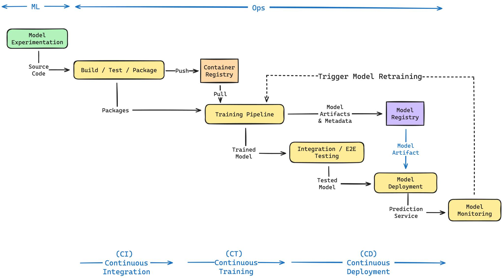

## Notes

- [CI/CD for Machine Learning in 2024: Best Practices to Build, Train, and Deploy](https://www.qwak.com/post/ci-cd-pipelines-for-machine-learning)

- [MLOps Principles](https://ml-ops.org/content/mlops-principles)

- [MLOps Automation — CI/CD/CT for Machine Learning (ML) Pipelines](https://medium.com/@weiyunna91/mlops-automation-ci-cd-ct-for-machine-learning-ml-pipelines-5f7cc343e002)

- [Best practices for Terraform CI/CD](https://buildkite.com/resources/blog/best-practices-for-terraform-ci-cd/)

## References 

- image came from : https://www.qwak.com/post/ci-cd-pipelines-for-machine-learning