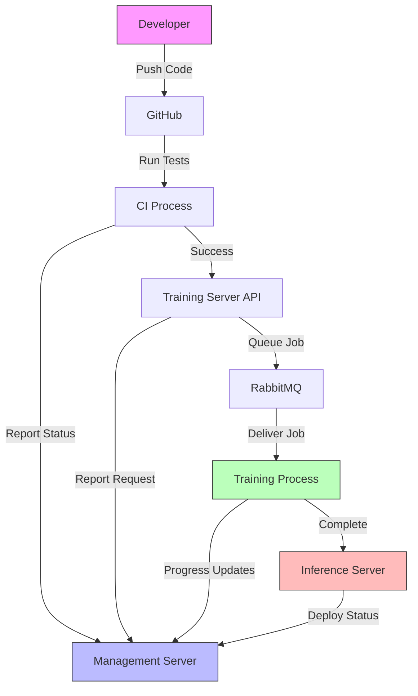

# CT: Continuous Training

```mermaid

flowchart TD
    Dev[Developer] --> |Push Code| Git[GitHub]
    Git --> |Run Tests| CI[CI Process]
    
    CI --> |Success| TS[Training Server API]
    CI --> |Report Status| MS[Management Server]
    
    TS --> |Queue Job| RMQ[RabbitMQ]
    TS --> |Report Request| MS
    
    RMQ --> |Deliver Job| Train[Training Process]
    Train --> |Progress Updates| MS
    
    Train --> |Complete| IS[Inference Server]
    IS --> |Deploy Status| MS
    
    style Dev fill:#f9f,stroke:#333
    style MS fill:#bbf,stroke:#333
    style Train fill:#bfb,stroke:#333
    style IS fill:#fbb,stroke:#333

```
