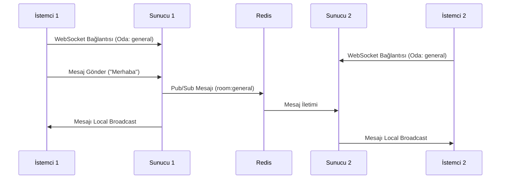

İşte Redis kullanarak WebSocket broadcast işlemleri için kapsamlı bir implementasyon rehberi:

---

## **Redis ile Broadcast ve Çoklu Sunucu Desteği**

### **1. BroadcastManager Sınıfı (Redis Pub/Sub Entegreli)**
```python
import aioredis
import json
from fastapi import WebSocket
from typing import Dict, Set

class BroadcastManager:
    def __init__(self):
        self.pub_redis = None
        self.sub_redis = None
        self.channel = "websocket_messages"
        self.connections: Dict[str, Set[WebSocket]] = {}

    async def connect(self):
        self.pub_redis = await aioredis.create_redis_pool("redis://localhost")
        self.sub_redis = await aioredis.create_redis_pool("redis://localhost")
        await self.sub_redis.subscribe(self.channel)

    async def add_connection(self, room: str, websocket: WebSocket):
        if room not in self.connections:
            self.connections[room] = set()
        self.connections[room].add(websocket)

    async def remove_connection(self, room: str, websocket: WebSocket):
        if room in self.connections:
            self.connections[room].discard(websocket)
            if not self.connections[room]:
                del self.connections[room]

    async def _publish(self, message: dict):
        await self.pub_redis.publish(self.channel, json.dumps(message))

    async def local_broadcast(self, room: str, message: dict):
        if room in self.connections:
            for websocket in self.connections[room]:
                await websocket.send_json(message)

    async def global_broadcast(self, room: str, message: dict):
        # Tüm sunuculara mesajı yayınla
        await self._publish({"room": room, "message": message})

    async def listener(self):
        while True:
            msg = await self.sub_redis.get_msg()
            if msg["type"] == "message":
                data = json.loads(msg["data"])
                await self.local_broadcast(data["room"], data["message"])
```

---

### **2. FastAPI Entegrasyonu**
```python
from fastapi import FastAPI, WebSocket, Depends
from contextlib import asynccontextmanager
import asyncio

broadcast_manager = BroadcastManager()

@asynccontextmanager
async def lifespan(app: FastAPI):
    await broadcast_manager.connect()
    asyncio.create_task(broadcast_manager.listener())
    yield
    await broadcast_manager.pub_redis.close()
    await broadcast_manager.sub_redis.close()

app = FastAPI(lifespan=lifespan)

@app.websocket("/ws/{room}")
async def websocket_endpoint(websocket: WebSocket, room: str):
    await websocket.accept()
    await broadcast_manager.add_connection(room, websocket)
    
    try:
        while True:
            data = await websocket.receive_text()
            await broadcast_manager.global_broadcast(room, {"message": data})
            
    except Exception as e:
        print(f"Hata: {e}")
    finally:
        await broadcast_manager.remove_connection(room, websocket)
```

---

### **3. Mesaj Akış Diyagramı**


---

### **4. Temel İşlemler ve Metodoloji**

#### **4.1 Bağlantı Yönetimi**
- **Yeni Bağlantı**: İstemci bağlandığında ilgili odaya kaydedilir
- **Bağlantı Sonlandırma**: İstemci ayrıldığında Redis'ten kaldırılır
- **Oda Bazlı Gruplama**: Mesajlar sadece ilgili odalara gönderilir

#### **4.2 Mesaj Yayınlama Mekaniği**
1. **Lokal Broadcast**: Aynı sunucuya bağlı istemcilere direkt iletilir
2. **Global Broadcast**: Redis Pub/Sub ile tüm sunuculara yayınlanır
3. **Veri Formatı**: JSON mesajları zorunlu hale getirilir

---

### **5. Gelişmiş Özellikler**

#### **5.1 Mesaj Şeması Doğrulama**
```python
from pydantic import BaseModel

class MessageSchema(BaseModel):
    type: str
    content: dict
    timestamp: float

async def validate_message(raw_data: str):
    try:
        return MessageSchema(**json.loads(raw_data))
    except Exception as e:
        raise ValueError(f"Geçersiz mesaj: {str(e)}")
```

#### **5.2 Hata Yönetimi**
```python
@app.websocket("/ws/{room}")
async def websocket_endpoint(websocket: WebSocket, room: str):
    try:
        # ... mevcut kodlar
    except WebSocketDisconnect:
        await broadcast_manager.remove_connection(room, websocket)
    except json.JSONDecodeError:
        await websocket.send_text("HATA: Geçersiz JSON formatı")
    except ValueError as e:
        await websocket.send_text(f"HATA: {str(e)}")
```

---

### **6. Performans Optimizasyonları**

#### **6.1 Connection Pooling**
```python
async def get_redis_pool():
    return await aioredis.create_redis_pool(
        "redis://localhost",
        minsize=5, 
        maxsize=20
    )
```

#### **6.2 Mesaj Sıkıştırma**
```python
import zlib

async def send_compressed(websocket: WebSocket, message: dict):
    compressed = zlib.compress(json.dumps(message).encode())
    await websocket.send_bytes(compressed)

async def receive_compressed(websocket: WebSocket):
    data = await websocket.receive_bytes()
    return json.loads(zlib.decompress(data))
```

---

### **7. Production Ready Ayarlar**

#### **7.1 Redis Sentinel Konfigürasyonu**
```python
sentinel = aioredis.sentinel.Sentinel(
    [('sentinel1', 26379), ('sentinel2', 26379)],
    password='your_password'
)

async def get_redis():
    master = sentinel.master_for("mymaster")
    return master
```

#### **7.2 Health Check Endpoint**
```python
@app.get("/health")
async def health_check():
    return {
        "redis_status": "active" if broadcast_manager.pub_redis.ping() else "inactive",
        "connections": sum(len(v) for v in broadcast_manager.connections.values())
    }
```

---

### **8. Test Senaryoları**

#### **8.1 Lokal Test**
```python
import pytest
from httpx import AsyncClient

@pytest.mark.asyncio
async def test_broadcast():
    async with AsyncClient(app=app, base_url="http://test") as ac:
        async with ac.websocket_connect("/ws/test_room") as websocket:
            await websocket.send_text("Test mesajı")
            data = await websocket.receive_json()
            assert data["message"] == "Test mesajı"
```

#### **8.2 Çoklu Sunucu Testi**
```bash
# 1. Sunucu
uvicorn main:app --port 8000

# 2. Sunucu 
uvicorn main:app --port 8001

# Test komutu (tüm sunuculara mesaj gönderimini test et)
redis-cli publish websocket_messages '{"room":"general","message":"global_test"}'
```

---

Bu implementasyon ile:
- **Gerçek Zamanlı** iletişim
- **Yatay Ölçeklenebilirlik**
- **Yüksek Erişilebilirlik**
- **Güvenli Mesajlaşma**

sağlanır. Tüm kod parçaları async/await yapısına uygun olarak tasarlanmıştır.