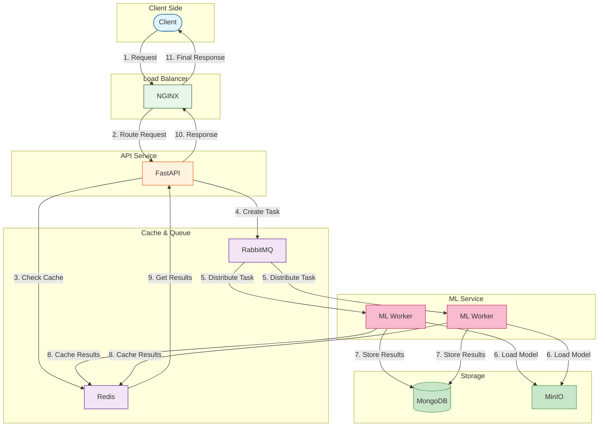

SIMPLIFIED COMPONENTS:

1. Core Services:
```
NGINX (Load Balancer):
- Route requests
- SSL termination
- Basic load balancing

FastAPI:
- Handle requests
- Task management
- Response handling

RabbitMQ:
- Task queue
- Message distribution
- Worker coordination

Redis:
- Results caching
- Session management
- Temporary storage
```

2. Storage:
```
MongoDB:
- Task results
- User data
- System logs

MinIO:
- ML model files
- Large datasets
- Binary data
```

3. Processing:
```
ML Workers:
- Model loading
- Inference
- Result generation
```

BASIC FLOW:

1. Request Handling:
```
Client → NGINX → FastAPI
- Request validation
- Authentication
- Task creation
```

2. Processing:
```
FastAPI → RabbitMQ → Workers
- Task distribution
- Model inference
- Result generation
```

3. Storage & Response:
```
Workers → MongoDB/Redis → FastAPI → Client
- Result storage
- Cache update
- Response delivery
```
