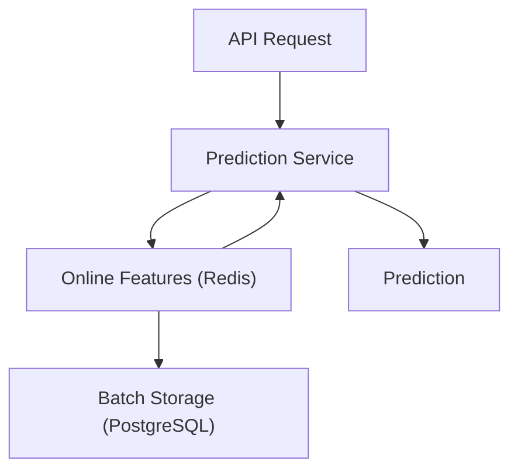

# Feature Store Notes

- [What is a Feature Store in ML, and Do I Need One?](https://www.qwak.com/post/what-is-a-feature-store-in-ml)

- [Feature Store - MadewithML](https://madewithml.com/courses/mlops/feature-store/#when-do-i-need-a-feature-store)
    - [repo link](https://github.com/GokuMohandas/feature-store/tree/main)

- [Feature Store : Definitve Guide - Hopworks-blog](https://mljam.com/feature-store/)

**Feature Store in Inference API**

### Examples

- [feast-credit-score-local-tutorial](https://github.com/feast-dev/feast-credit-score-local-tutorial)
- [feast worrkshop](https://github.com/feast-dev/feast-workshop)
- [feat tutorial](https://github.com/iamirmasoud/feast-tutorial/tree/masterl)
- [feature_store_with_feast](https://github.com/GokuMohandas/feature-store/blob/main/feature_store.ipynb)