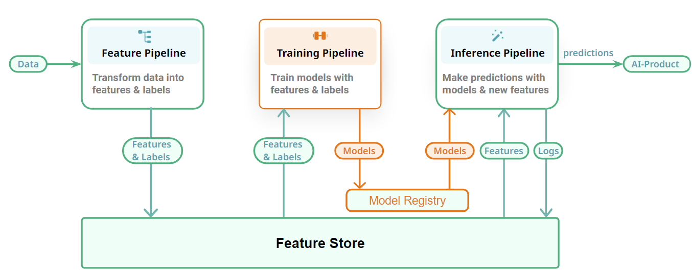
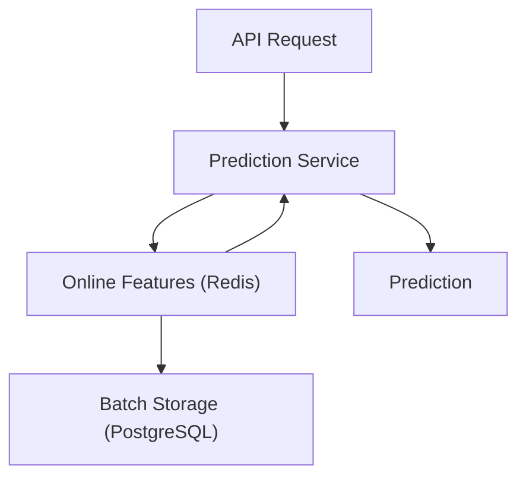

# Feature Store Notes

- [What is a Feature Store in ML, and Do I Need One?](https://www.qwak.com/post/what-is-a-feature-store-in-ml)

- [Feature Store - MadewithML](https://madewithml.com/courses/mlops/feature-store/#when-do-i-need-a-feature-store)
    - [repo link](https://github.com/GokuMohandas/feature-store/tree/main)

- [Feature Store : Definitve Guide - Hopworks-blog](https://mljam.com/feature-store/)
- [Data Science and MLOps with Feast: Mastering Feature Store - blog](https://oleg-dubetcky.medium.com/data-science-and-mlops-with-feast-mastering-feature-store-2b92c55ddd25)
- [Feast Feature Store — An In-depth Overview Experimentation and Application in Tabular data - blog](https://medium.com/@ongxuanhong/mlops-03-feast-feature-store-an-in-depth-overview-experimentation-and-application-in-tabular-b9d1c5376483)

**Feature Store in Inference API Diagram**

### Examples

- [feast-credit-score-local-tutorial **](https://github.com/feast-dev/feast-credit-score-local-tutorial)
- [feast worrkshop](https://github.com/feast-dev/feast-workshop)
- [feat tutorial](https://github.com/iamirmasoud/feast-tutorial/tree/masterl)
- [feature_store_with_feast](https://github.com/GokuMohandas/feature-store/blob/main/feature_store.ipynb)
- [feast_epam **](https://github.com/ElliotNguyen68/feast_epam/tree/main)