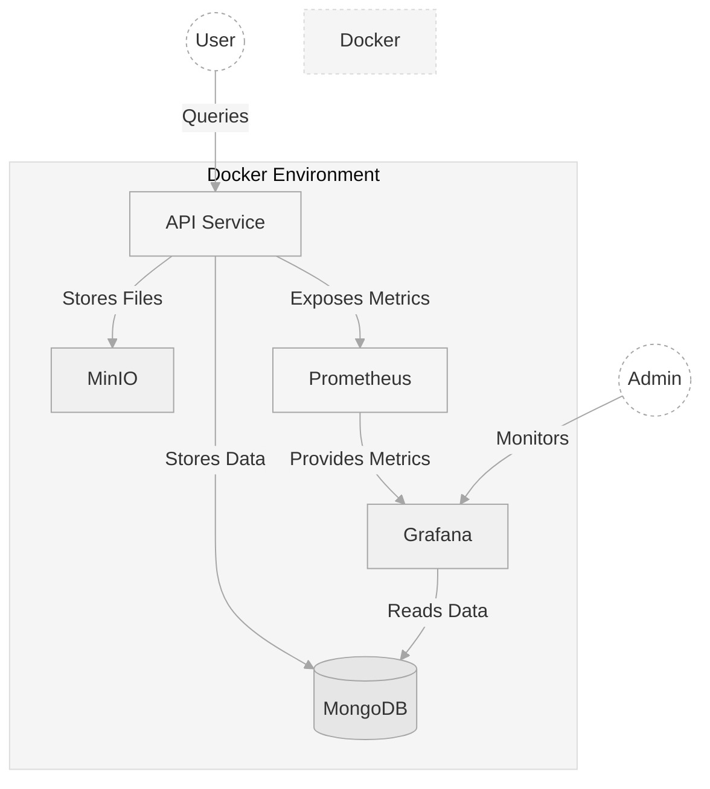

# ML API Template

This project provides a template for a Machine Learning API with integrated MLOps components. It's designed to be easily deployable and scalable, with built-in monitoring and storage solutions.

## Table of Contents

- [ML API Template](#ml-api-template)
  - [Table of Contents](#table-of-contents)
  - [Features](#features)
  - [Architecture](#architecture)
  - [Prerequisites](#prerequisites)
  - [Configuration](#configuration)
  - [Usage](#usage)
    - [Docker Compose](#docker-compose)
    - [Makefile](#makefile)
  - [API Documentation](#api-documentation)
  - [Monitoring](#monitoring)

## Features

- FastAPI-based ML service
- MongoDB for data storage
- MinIO for object storage
- Prometheus for metrics collection
- Grafana for visualization and monitoring
- Docker Compose for easy deployment

## Architecture



## Prerequisites

- Docker and Docker Compose
- Make

## Configuration

The API uses environment variables for configuration. Create a `.env` file in the root directory with the following variables:

```bash
MINIO_ACCESS_KEY=minioadmin
MINIO_SECRET_KEY=minioadmin

MONGODB_PORT=27017
MONGODB_ROOT_USERNAME=root
MONGODB_ROOT_PASSWORD=example

GRAFANA_ADMIN_USER=admin
GRAFANA_ADMIN_PASSWORD=admin
```

Additional configuration can be set in `config/config.yaml`.

## Usage

### Makefile

- Start the entire stack with .env parameters, check makefile:
  ```bash
  make docker-up
  ```

- Stop the entire stack:
  ```bash
  make docker-down
  ```

## API Documentation

Once the API is running, you can access the auto-generated API documentation at:

- Swagger UI: `http://localhost:8000/docs`
- ReDoc: `http://localhost:8000/redoc`

## Monitoring

- Grafana: `http://localhost:3000`
- Prometheus: `http://localhost:9090`
- MinIO Console: `http://localhost:9001`

