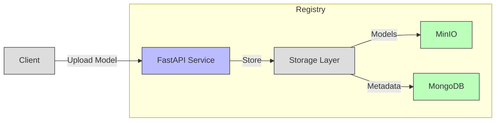

# Model Registry

A lightweight, extensible model registry for machine learning models. This registry provides storage and versioning for ML models with metadata management.

## System Architecture



## Features

- 📦 Model artifact storage using MinIO
- 📝 Metadata management with MongoDB
- 🔄 Version tracking
- 🔍 Model search and retrieval
- 🧰 Easy-to-use Python client

## Quick Start

1. Start the services:

```bash
docker-compose up -d
```

2. Install the package:

```bash
pip install -e .
```

3. Use the client:

```python
from registry.client import ModelRegistryClient

# Initialize client
client = ModelRegistryClient()

# Register a model
response = client.upload_model(
    model_path="path/to/model.pkl",
    name="my_model",
    version="1.0.0",
    description="My trained model",
    metadata={metrics={"accuracy": 0.95}}
)

```

## Project Structure

```
model-registry/
├── registry/
│   ├── api.py           # FastAPI implementation
│   ├── client.py        # Python client
│   ├── config.py        # Configuration settings
│   ├── registry.py      # Core registry logic
│   ├── schema.py        # Data models
│   └── storage/         # Storage implementations
│       ├── base.py      # Storage interfaces
│       ├── minio.py     # MinIO storage
│       └── mongo.py     # MongoDB storage
└── tests/               # Test suite
```

## Configuration

Set up using environment variables or `.env`:

```env
MINIO_ENDPOINT=localhost:9000
MINIO_ACCESS_KEY=minioadmin
MINIO_SECRET_KEY=minioadmin
MONGO_URI=mongodb://localhost:27017
```

## Development

Run tests:

```bash
pytest
```

## Future Improvements

- [ ] Add authentication
- [ ] Add model validation
- [ ] Add metrics visualization
- [ ] Support more storage backends

## License

MIT License
