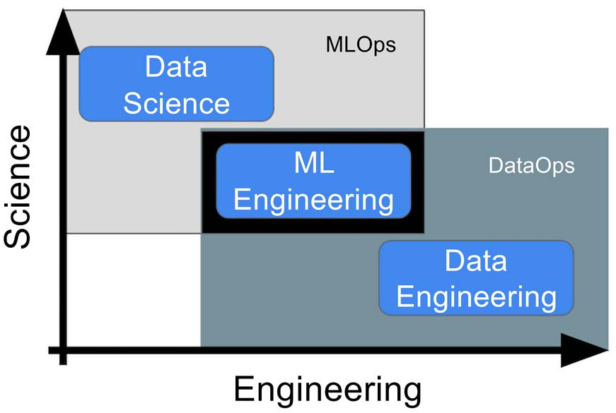

**Data scientist**

After the Harvard Business Review declared that being a data scientist was The Sexiest Job of the 21st
Century (https://hbr.org/2012/10/data-scientist-the-sexiest-job-of-the-21st-century),
this job role became one of the most sought after, but also hyped, in the mix. Its popularity remains
high, but the challenges of taking advanced analytics and ML into production have meant there
has been more and more of a shift toward engineering roles within data-driven organizations. The
traditional data scientist role can cover an entire spectrum of duties, skills, and responsibilities
depending on the business vertical, the organization, or even just personal preference. No matter
how this role is defined, however, there are some key areas of focus that should always be part
of the data scientist’s job profile:
- Analysis: A data scientist should be able to wrangle, munge, manipulate, and consolidate
datasets before performing calculations on the data that help us to understand it. Analysis
is a broad term, but it’s clear that the end result is knowledge of your dataset that you
didn’t have before you started, no matter how basic or complex.
- Modeling: The thing that gets everyone excited (potentially including you, dear reader)
is the idea of modeling phenomena found in your data. A data scientist usually has to be
able to apply statistical, mathematical, and ML techniques to data, in order to explain
processes or relationships contained within it and to perform some sort of prediction.Chapter 1

- Working with the customer or user: The data scientist role usually has some more
business-directed elements so that the results of the previous two points can support
decision-making in an organization. This could be done by presenting the results of the
analysis in PowerPoint presentations or Jupyter notebooks, or even sending an email with
a summary of the key results. It involves communication and business acumen in a way
that goes beyond classic tech roles.

**ML engineer**
The gap between creating ML proof-of-concept and building robust software, what I often refer
to in talks as “the chasm,” has led to the rise of what I would now argue is one of the most im-
portant roles in technology. The ML engineer serves an acute need to translate the world of data
science modeling and exploration into the world of software products and systems engineering.
Since this is no easy feat, the ML engineer has become increasingly sought after and is now a
critical piece of the data-driven software value chain. If you cannot get things into production,
you are not generating value, and if you are not generating value, well we know that’s not great!
You can articulate the need for this type of role quite nicely by considering a classic voice assistant.
In this case, a data scientist would usually focus on translating the business requirements into a
working speech-to-text model, potentially a very complex neural network, and showing that it can
perform the desired voice transcription task in principle. ML engineering is then all about how
you take that speech-to-text model and build it into a product, service, or tool that can be used
in production. Here, it may mean building some software to train, retrain, deploy, and track the
performance of the model as more transcription data is accumulated, or as user preferences are
understood. It may also involve understanding how to interface with other systems and provide
results from the model in the appropriate formats. For example, the results of the model may
need to be packaged into a JSON object and sent via a REST API call to an online supermarket, in
order to fulfill an order.
Data scientists and ML engineers have a lot of overlapping skillsets and competencies but have
different areas of focus and strengths (more on this later), so they will usually be part of the same
project team and may have either title, but it will be clear what hat they wear from what they
do in that project.
Similar to the data scientist, we can define the key areas of focus for the ML engineer:

- Translation: Taking models and research code in a variety of formats and translating
them into slicker, more robust pieces of code.Introduction to ML Engineering This can be done using OO programming, functional programming, a mix, or something
else, but it basically helps to take the proof-of-concept work of the data scientist and turn
it into something that is far closer to being trusted in a production environment.

- Architecture: Deployments of any piece of software do not occur in a vacuum and will
always involve lots of integrated parts. This is true of ML solutions as well. The ML engi-
neer has to understand how the appropriate tools and processes link together so that the
models built with the data scientist can do their job and do it at scale.
- Productionization: The ML engineer is focused on delivering a solution and so should
understand the customer’s requirements inside out, as well as be able to understand what
that means for the project development. The end goal of the ML engineer is not to provide
a good model (though that is part of it), nor is it to provide something that basically works.
Their job is to make sure that the hard work on the data science side of things generates
the maximum potential value in a real-world setting.

**ML operations engineer**
ML engineering will be the focus of this book, but there is an important role now emerging with
the aim of enabling ML engineers to do their work with higher quality, at greater pace, and at a
larger scale. These are the Machine Learning Operations (MLOps) engineers. This role is all about
building out the tools and capabilities that enable the tasks of the ML engineer and data scientists.
This role focuses more on building out the tooling, platforms, and automation used by the other
roles, and so connects them nicely. That is not to say MLOps engineers will not be used in specific
projects or builds; it is just that their main value-add comes not from this but from enabling the
capabilities used during a specific project or build. If we revisit the example of the speech-to-text
solution described in the ML engineer section, we can get a flavor of this. Where the ML engineer
will be worried about building out a solution that works seamlessly in production, the MLOps
engineer will work hard to build out the platform or toolset that the ML engineer uses to do this.
The ML engineer will build pipelines, but the MLOps engineer may build pipeline templates; the
ML engineer may use continuous integration/continuous deployment (CI/CD) practices (more
on this later), but the MLOps engineer will enable that capability and define the best practice to
use CI/CD smoothly. Finally, where the ML engineer thinks “How do I solve this specific problem
robustly using the proper tools and techniques?”, the MLOps engineer asks “How do I make sure
that the ML engineers and data scientists will be able to, in general, solve the types of problems
they need to, and how can I continually update and improve that setup?”Chapter 1
As we did with the data scientist and ML engineer, let us define some of the key areas of focus
for the MLOps engineer:

- Automation: Increasing the level of automation across the data science and ML engineer-
ing workflows through the use of techniques such as CI/CD and Infrastructure-as-Code
(IAC). Pre-package software that can be deployed to allow for smoother deployments of
solutions through these capabilities and more, such as automation scripts or standard-
ized templates.

- Platform engineering: Working to integrate a series of useful services together in order
to build out the ML platform for the different data-driven teams to use. This can include
developing integrations across orchestration tools, compute, and more data-driven ser-
vices until they become a holistic whole for use by ML engineers and data scientists.
- Enabling key MLOps capabilities: MLOps consists of a set of practices and techniques
that enable the productionization of ML models by the other engineers in the team. Ca-
pabilities such as model management and model monitoring should be enabled by the
MLOps engineers in a way that can be used at scale across multiple projects.

It should be noted that some of the topics covered in this book could be carried out by an MLOps
engineer and that there is naturally some overlap. This should not concern us too much, as MLOps
is based on quite a generic set of practices and capabilities that can be encompassed by multiple
roles (see Figure 1.1).

**Data engineer** 
The data engineers are the people responsible for getting the commodity that everything else in
the preceding sections is based on from A to B with high fidelity, appropriate latency, and as little
effort on the part of the other team members as possible. You cannot create any type of software
product, never mind an ML product, without data.
The key areas of focus for a data engineer are as follows:

- Quality: Getting data from A to B is a pointless exercise if the data is garbled, fields are
missing, or IDs are screwed up. The data engineer cares about avoiding this and uses
a variety of techniques and tools, generally to ensure that the data that left the source
system is what lands in your data storage layer.
- Stability: Similar to the previous point on quality, if the data comes from A to B but it only
arrives every second Wednesday if it’s not a rainy day, then what’s the point?Introduction to ML Engineering
Data engineers spend a lot of time and effort and use their considerable skills to ensure
that data pipelines are robust, reliable, and can be trusted to deliver when promised.
- Access: Finally, the aim of getting data from A to B is for it to be used by applications,
analyses, and ML models, so the nature of B is important. The data engineer will have a
variety of technologies to hand to surface data and should work with the data consumers
(our data scientists and ML engineers, among others) to define and create appropriate
data models within these solutions:

As mentioned previously, this book focuses on the work of the ML engineer and how you can
learn some of the skills useful for that role, but it is important to remember that you will not be
working in a vacuum. Always keep in mind the profiles of the other roles (and many more not
covered here that will exist in your project team) so that you work most effectively together. Data
is a team sport after all!
Now that you understand the key roles in a modern data team and how they cover the spectrum
of activities required to build successful ML products, let’s look at how you can put them together
to work efficiently and effectively.